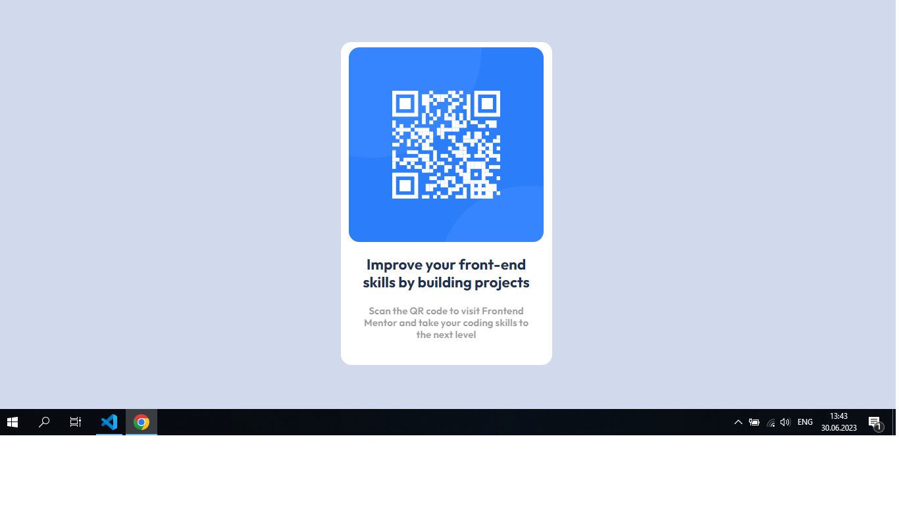
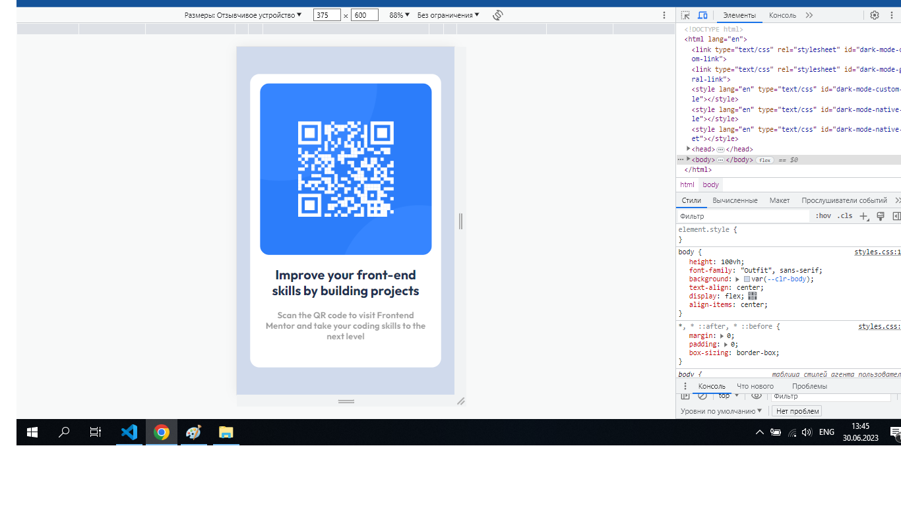

# Frontend Mentor - QR code component solution

This is a solution to the [QR code component challenge on Frontend Mentor](https://www.frontendmentor.io/challenges/qr-code-component-iux_sIO_H). Frontend Mentor challenges help you improve your coding skills by building realistic projects.

## Table of contents

- [Overview](#overview)
  - [Screenshot](#screenshot)
  - [Links](#links)
- [My process](#my-process)
  - [Built with](#built-with)
  - [What I learned](#what-i-learned)
  - [Continued development](#continued-development)
  - [Useful resources](#useful-resources)
- [Author](#author)
- [Acknowledgments](#acknowledgments)

## Overview

### Screenshot

 - DESKTOP
 - MOBILE

### Links

- Solution URL: [https://codepen.io/01JohnnyJohn/pen/MWzmpdY]
- Live Site URL: [https://chipper-madeleine-008d0e.netlify.app/]

## My process

Generally, it was not hard.
Mostly, I need and want to practice how to right code methodically, logically, adherently, practice following a correct workflow, instead of jumping from one part to another, making small adjustments here and there.

### Built with

- Semantic HTML5 markup
- CSS custom properties
- Flexbox
- CSS Grid
- Mobile-first workflow

**Note: These are just examples. Delete this note and replace the list above with your own choices**

### What I learned

### Continued development

Want to learn and practice following a correct workflow.

### Useful resources

## Author

- Frontend Mentor - [@01JohnnyJohn](https://www.frontendmentor.io/profile/yourusername)

## Acknowledgments
