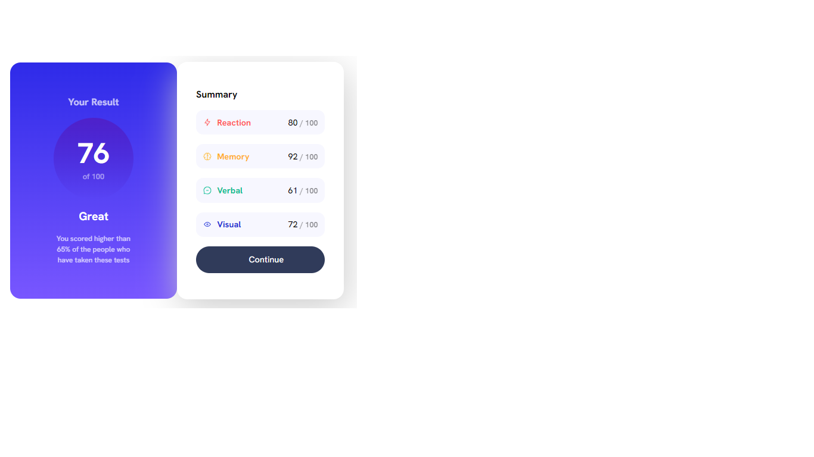
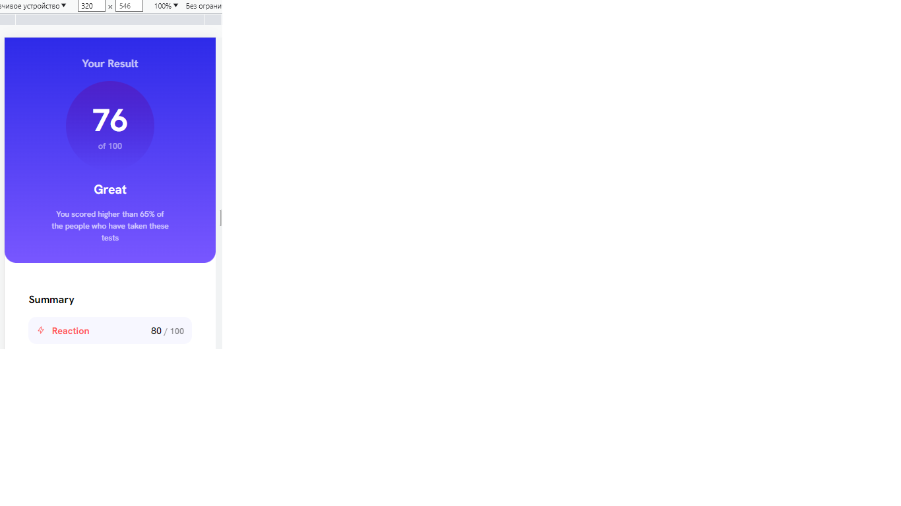

# Frontend Mentor - Results summary component solution

This is a solution to the [Results summary component challenge on Frontend Mentor](https://www.frontendmentor.io/challenges/results-summary-component-CE_K6s0maV). Frontend Mentor challenges help you improve your coding skills by building realistic projects.

## Table of contents

- [Overview](#overview)
  - [The challenge](#the-challenge)
  - [Screenshot](#screenshot)
  - [Links](#links)
- [My process](#my-process)
  - [Built with](#built-with)
  - [What I learned](#what-i-learned)
  - [Continued development](#continued-development)
  - [Useful resources](#useful-resources)
- [Author](#author)
- [Acknowledgments](#acknowledgments)

## Overview

### The challenge

Users should be able to:

- View the optimal layout for the interface depending on their device's screen size
- See hover and focus states for all interactive elements on the page (a number of interactive elements depends on whether JavaScript is used or not in this project)

### Screenshot

### Links

- Solution URL: [https://github.com/01JohnnyJohn/FrontendMentor.io/tree/main]
- Live Site URL: [https://playful-beignet-6b5ad4.netlify.app]

## My process

The process was a lot less messed up then the previous project. It was more smooth then the previous one. I did less jumping from here to there while styling in CSS.
I tried as much as I can to follow the workflow
I've made this project with mobile-first "method"

When I finished the project I realized that I did those two parts of the component separately while they are actually both lay in one container and the blue section is another container inside the major container and the right white section is either another container next to the blue one or is just the part of the main container but placed in its right side

When I tried to fixed it it broke some layout, so I decided to let it be as it is, because it almost matches the target design and it looks not bad.

### Built with

- Semantic HTML5 markup
- CSS custom properties
- Flexbox
- CSS Grid
- Mobile-first workflow

### What I learned

Learned how to analyse better the project before actually starting to create it.
Improved in following the workflow
Improved in identifying common classes that should be given to HTML elements thus improving the creation of the CSS part of the project

### Continued development

### Useful resources

## Author

- Frontend Mentor - [@01JohnnyJohn](https://www.frontendmentor.io/profile/yourusername)

## Acknowledgments
